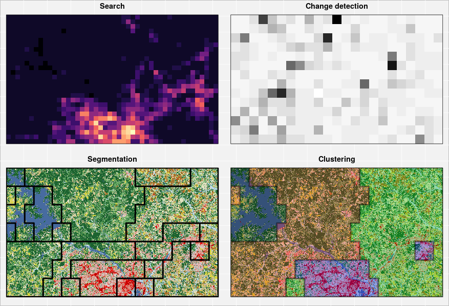

# GeoPAT 2.0 - the manual

## Overview

GeoPAT (Geospatial Pattern Analysis Toolbox) is a standalone suite of modules written in C and dedicated to analysis of large Earth Science datasets in their entirety using spatial and/or temporal patterns. 
Global scale, high resolution spatial datasets are available but are mostly used in small pieces for local studies. 
GeoPAT enables studying them in their entirety.
GeoPAT’s core idea is to tessellate global spatial data into grid of square blocks of original cells (pixels).
This transforms data from its original form (huge number of cells each having simple content) to a new form (much smaller number of supercells/blocks with complex content).
Complex cell contains a pattern of original variable.
GeoPAT provides means for succinct description of such patterns and for calculation of similarity between patterns.
This enables spatial analysis such as clustering, segmentation, and search to be performed on the grid of complex cells (local patterns).

The GeoPAT 2.0 software is available at http://sil.uc.edu/cms/index.php?id=geopat2.

The GeoPAT 2.0 manual is at https://rawgit.com/Nowosad/geopat2_manual/master/output/GeoPAT2_Manual.pdf.

## Contribution

We encourage contributions on any part of the GeoPAT 2.0 manual, including:

- Improvements to the text, e.g. clarifying unclear sentences, fixing typos
- Suggestions on content (see [the project's issue tracker](https://github.com/Nowosad/geopat2_manual/issues))
